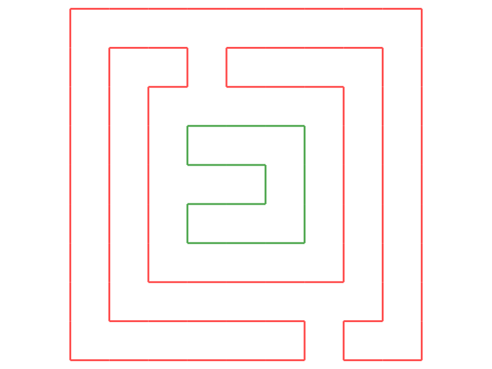

The project is not that compilcated :

- we take as input a set of simple polygons
- we display on the standard output which polygon is included in which other polygon

## Input

We get as input a set of polygons from a *.poly* file.
This text file format is based on the following principle:

- each line consists of 3 elements separated by one or more spaces: an integer, a float, a float
- the two floats form the *x* and *y* coordinates of a point
- the integer at the beginning of the line indicates to which polygon this point is added, starting from 0
- the order of the lines of the file indicates the order of the points of the polygons
- the indices of the polygons are consecutive (all the points of polygon 0, then all the points of polygon 1, ...)

On loading, each file is converted into a vector of polygons.

Note that there is **never** an intersection of segments between two different polygons.
Within the same polygon only the consecutive segments intersect and only at their extremities.

## Inclusion detection

For this project, one of the basic algorithms you will need
implement is to detect if a point is inside a polygon. We can get there by *starting* from the point in
an arbitrary direction and counting the number of segments of the polygon crossed on our way. If it's odd the
point is inside if not outside. To try to avoid problems with rounding errors and simplify calculations,
the best is to advance vertically or horizontally.

Pour plus d'info voir [wikipedia](https://en.wikipedia.org/wiki/Point_in_polygon)

## Output

On output you are asked to display on the standard output the vector indicating which polygon is included (directly) in which other polygon.
Each polygon is identified by its number. As any polygon can only be included (directly) in at most one other polygon, it suffices to store the solution to associate to each polygon the index of its father or *-1* if it has none.
The simplest way is then to store this information in a vector such that the ith box contains the father of the ith polygon.

For example, the *10x10.poly* file provided contains the two polygons below:

Polygon 0 is displayed in red and polygon 1 in green. Since green is included in red and red is not included in anyone, the solution is the vector [-1, 0].

Displaying the solution simply consists of *printing* this vector, which is already done on line 30
of the supplied *main.py* file.

Second example, the following *e2.poly* file (0 is red, 1 is green, 2 is blue, 3 is purple):

a pour solution : [1, -1, 0, 0]

## Code provided

We provide you with a small geometry module: *geo*.

This contains all the basic classes (points, segments, polygons) as well as a display module based on *tycat*.
All base objects are displayable as well as iterables and iterators on base objects.
You can see how it works by looking at the *hello.py* and *tycat.py* files.

The *main.py* file is important because it will be used for automatic tests. You can (must) modify it but be careful!
The semantics must be respected: the standard output must contain exactly one line per file given as an argument, in the order given.
Each line is a *print* of a vector of integers.

